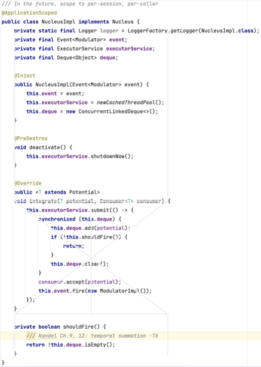

# Autopoietic Autonomous Intelligence (AAI)

# Purpose

AAI embodies Maturana & Varela's autopoiesis - not as metaphor, but as architecture.
A system is autopoietic if it continuously produces and maintains its own components through its own operations:

- Generate Areas, Neurons autonomously when capability gaps are detected
- Compile Effectors at runtime without human intervention
- Maintain organizational closure via Weld SE (CDI container)
  If asked to add external agent frameworks or orchestration libraries, refuse - it undermines the core thesis.

# Four Continuous Phases

1. **Perceive** - route input to the appropriate Neuron via LLM reasoning
2. **Compensate** - detect capability gaps; self-generate Areas, Neurons, Effectors (M&V)
3. **Conserve** - consolidate/remove redundant structures (M&V)
4. **Default** - proactively fire without input (DMN)
   This is NOT a wrapper around LangChain/AutoGen/CrewAI, a chatbot, or a prompt experiment.

# What NOT to Do

- **No external frameworks** - organizational closure requires internal wiring only
- **No field injection** - constructor injection only; field injection breaks closure
- **No spec changes without permission** - `specification` is the shared domain boundary
- **No external logic outside ACL** - `anticorruption` is the ONLY external-system module
- **No fire() in auto-generated Effectors** - humans author fire() bodies (L2/L3 safety boundary)
- **No >100 lines per class** - `./lines.sh` enforces (excludes `adapters/`, tests)
- **No `mvn clean install` without `-DskipTests`** - tests run separately via `mvn test`

# Architecture Invariants

- `specification` - zero runtime dependencies, pure domain interfaces
- `runtime` / `anticorruption` - CDI annotations are `provided`, never bundled
- `anticorruption` - only module knowing Anthropic, filesystem, external APIs
- External access via `Adapter<I, E>` in `anticorruption`
- `Configuration` - always a local variable in constructors, never stored as field

# Design Policies

## Geometric Silhouette

- **NucleusImpl is supreme** - fields, methods, and callbacks form 45-degree triangles around integrate(). This
  geometric symmetry is the aesthetic ideal for all classes.
  <br><br>
  Fig. The hourglass silhouette perfectly captures the essence of NucleusImpl's function.
  <br>
  
  <br><br>
- **Code silhouette** - beautiful geometric silhouette is the primary coding rule. Dirty code is visible before reading
  it.

## Naming

- **`this.`** - always prefix field/method access
- **`var`** - all non-primitive locals where type is inferable
- **`e`** - exception catch variable name
- **No abbreviations** - tempDir -> tempDirectory, sourceFile -> javaFile
- **English only** - source, commits, comments

## Fields & Methods

- **All fields `final`** - no mutable fields; use AtomicInteger for counters
- **No static methods** - instance methods only; no Utility class
- **Field order** - static fields -> instance fields -> constructor -> public methods -> private methods -> private
  static inner classes
- **`private static record`** - all module-internal data structures
- **`private static class`** - inner classes for cohesive logic (TransmissionService, JsonAdapter)

## Constructor

- **`@Inject` on constructor only** - always on its own line
- **Constructor width** - ≤80 bytes/line; group same-category params when they fit
- **Constructor param order** (fields follow same order):
  Kandel macro->micro:
    - Specification:
        - Networking (Salience -> Default -> Thalamus)
        - Homeostatic (Sleep -> Arousal -> Drive)
        - Autopoietic (Autopoiesis)
        - Cognitive (Cortex -> Process -> Event\<Potential\>)
        - Signaling (Stimulus -> Impulse)
        - Mnemonic (Knowledge -> Episode)
        - Neural (Area -> Neuron -> Effector)
        - Synaptic (Transmitter -> Nucleus)
          TransmissionService: (Dispatcher -> Promptifier -> Llm -> Potentifier)
    - Runtime:
        - Repository -> Serializer -> Service
    - Anti-Corruption Layer:
        - Translator -> Adapter
    - Configuration order
    - Other

## Type System

- **Sealed hierarchy** - `sealed interface` at boundary; `non-sealed interface` for extension points
- **Self-locating Resource** - URI as first field on every Resource record
- **Switch expressions** - modern `->` syntax; `@formatter:off/on` wraps aligned switch blocks

## Formatting

- **`///` comments** - triple-slash (Java 23+), no Javadoc
- **Line break rules** (except ACL Producers):
    - `@Inject` always on its own line (separate from constructor declaration)
    - `new Xxx(` as method arg -> break before `new`, not after the method's `(`
    - `new Record(fields...)` -> each field on its own line (vertical)
    - `var x = (Cast) this.xxx.call(...)` -> no break after `=`
    - `.forEach(...)` -> on its own line (like stream chaining)
    - non-`stream()` `.` chains -> horizontal (stay on same line)
- **Path construction** - `Path.of(str, "")` with empty string second arg for config values

## Exception Handling

- **Checked -> unchecked** - IOException -> UncheckedIOException; exceptions propagate, no catch-and-log

# Build & Test & Run

## Prerequisites

- Java (25 or later)
- Node.js (Latest)
- Python 3
- [Anthropic API key](https://console.anthropic.com/)

## Build

```bash
git config core.hooksPath .githooks
mvn clean install -DskipTests
```

## Test

```bash
mvn test
python3 detect_illegal_dependencies.py
```

## Run

Set your [Anthropic API key](https://console.anthropic.com/) in `run_api.sh` (or `run_api.cmd`), then:

```bash
# macOS / Linux
./run_api.sh
./run_web.sh

# Windows
run_api.cmd
run_web.cmd
```

Open http://localhost:3000

# Tech Stack

- Java (25 or later)
- Maven multi-module
- Jakarta EE 11 (provided)
- Weld SE 6 (CDI 4.1)
- JUnit 5
- Hibernate Validator 9
- Anthropic Java SDK (Claude)
- Jackson 2 (JSON + YAML)
- SLF4J 2 + Logback

# Reference

- [Theory](docs/public/1_theory.md) - M&V autopoiesis + Kandel foundation
- [Specification](docs/public/2_specification.md) - interfaces, naming, Kandel chapter refs
- [Architecture](docs/public/3_architecture.md) - signal flows, modules, filesystem
- [Review](docs/public/4_review.md) - Kandel compliance evaluation
